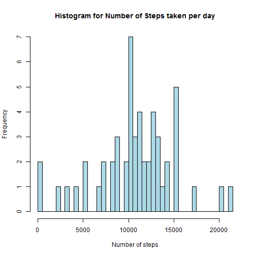
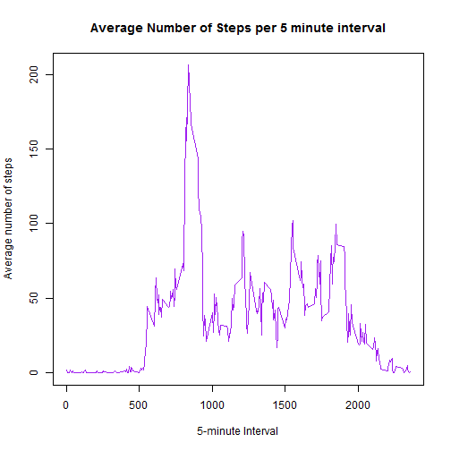
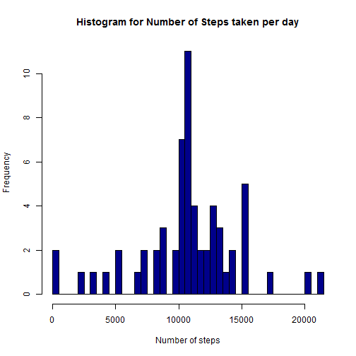
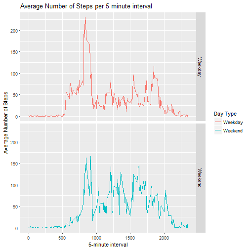

## Introduction

It is now possible to collect data about personal movement using activity trackers.  

This document looks at data collected from a personal monitoring device which consists of data from an anonymous individual collected in October and November 2012 and include the number of steps taken in 5 minute intervals each day.  


```r
rm(list = ls())

setwd("~/RWork/Coursera/Course 5/Week 2/repdata_data_activity/Final Assignment/")
activity <- read.csv('activity.csv', header = TRUE, sep = ",")
# Remove missiing values
activity2 <- activity[complete.cases(activity),]
```


## Analysis

#### Total Number of Steps Taken Each Day

The following histogram shows the total number of steps taken each day.  
NB: Missing values were excluded from the data for this part;  
Resulting set called "activity2".


```r
totActivity_day <- aggregate(activity2$steps, by = list(day = activity2$date), FUN=sum)

hist(totActivity_day$x, main = "Histogram for Number of Steps taken per day",
      xlab = "Number of steps", breaks = 50, col = "light blue")
```




```r
meanActivity <- mean(totActivity_day$x)
medianActivity <- median(totActivity_day$x)
```

The mean total number of steps taken per day:            1.0766189 &times; 10<sup>4</sup>  
The median total number of steps taken per day:          10765  

#### The Average Daily Activity Pattern

The following time series plot shows the average number of steps taken per 5-minute interval averaged across all days.


```r
totActivity_int <- aggregate(activity2$steps,
                      by = list(interval = activity2$interval), FUN = mean)
plot(totActivity_int$interval, totActivity_int$x, type = "l",
                xlab = "5-minute Interval", ylab = "Average number of steps",
              main = "Average Number of Steps per 5 minute interval", col = "purple")
```




```r
maxSteps <- totActivity_int[which.max(totActivity_int$x),]
max_last <- as.numeric(maxSteps$interval)
max_first <- max_last - 5
```

The maximum number of steps was in the 830 - 835 5-minute interval.  

#### Imputing Missing Values


```r
sumNA <- sum(is.na(activity))
```

Unfortunately, this set had 2304 missing values.  

To help with this, I decided to replace all missing values with the average of the corresponding 5-minute interval.  


```r
library(magrittr)
library(dplyr)
```

```
## 
## Attaching package: 'dplyr'
```

```
## The following objects are masked from 'package:stats':
## 
##     filter, lag
```

```
## The following objects are masked from 'package:base':
## 
##     intersect, setdiff, setequal, union
```

```r
activityB <- activity %>% group_by(interval) %>% mutate(avg = mean(steps, na.rm = TRUE))
activityB$steps[is.na(activityB$steps)] <- activityB$avg[is.na(activityB$steps)]
activityB$steps2 <- round(activityB$steps, digits = 0)

sum_NA2 <- sum(is.na(activityB))
```

After imputing, we now have 0 missing values!  
  
We're going to relook at the total number of steps taken each day now that we have dealt with the missing values.  


```r
totActivity_day_noNA <- aggregate(activityB$steps2, by = list(day = activityB$date), FUN=sum)

hist(totActivity_day_noNA$x, main = "Histogram for Number of Steps taken per day",
     xlab = "Number of steps", breaks = 50, col = "dark blue")
```



Did imputing values change the distribution of our data?  


```r
meanActivityB <- mean(totActivity_day_noNA$x)
medianActivityB <- median(totActivity_day_noNA$x)
```

The mean total number of steps taken per day with missing values:  
      1.0766189 &times; 10<sup>4</sup>  
The mean total number of steps taken per day without missing values:  
      1.0765639 &times; 10<sup>4</sup>  
The median total number of steps taken per day with missing values:  
      10765  
The median total number of steps taken per day without missing values:  
      1.0762 &times; 10<sup>4</sup>  
        
The values are quite close to each other, so we can assume it's safe to use the set with imputed values than the set with missing values.  

#### Activity Patterns between weekdays and  weekends

We will first by classifying each date according to the day of the week it was on and then group it further to whether it was a weekday or weekend.  


```r
weekdays1 <- c("Monday", "Tuesday", "Wednesday", "Thursday", "Friday")
activityC <- activityB %>% mutate(type = weekdays(as.Date(date)))
activityC$type2 <- factor(activityC$type %in% weekdays1, levels = c(TRUE, FALSE),
                          labels = c("Weekday", "Weekend"))
```

The following time series plots show the average number of steps taken per 5-minute interval averaged across all days, divided into weekdays and weekends.  


```r
activityC2 <- activityC %>% group_by(interval, type2) %>% mutate(avg = mean(steps))

library(ggplot2)
g <- ggplot(data = activityC2, aes(x = interval, y = avg, color = type2),
              ylab = "Average Number of Steps", xlab = "5 minute interval")
g + geom_line() + facet_grid( facets = type2 ~ .) +
      xlab("5-minute interval") + ylab("Average Number of Steps") +
      labs(title = "Average Number of Steps per 5 minute interval", color = "Day Type")
```




That is the end of the analysis for now!
